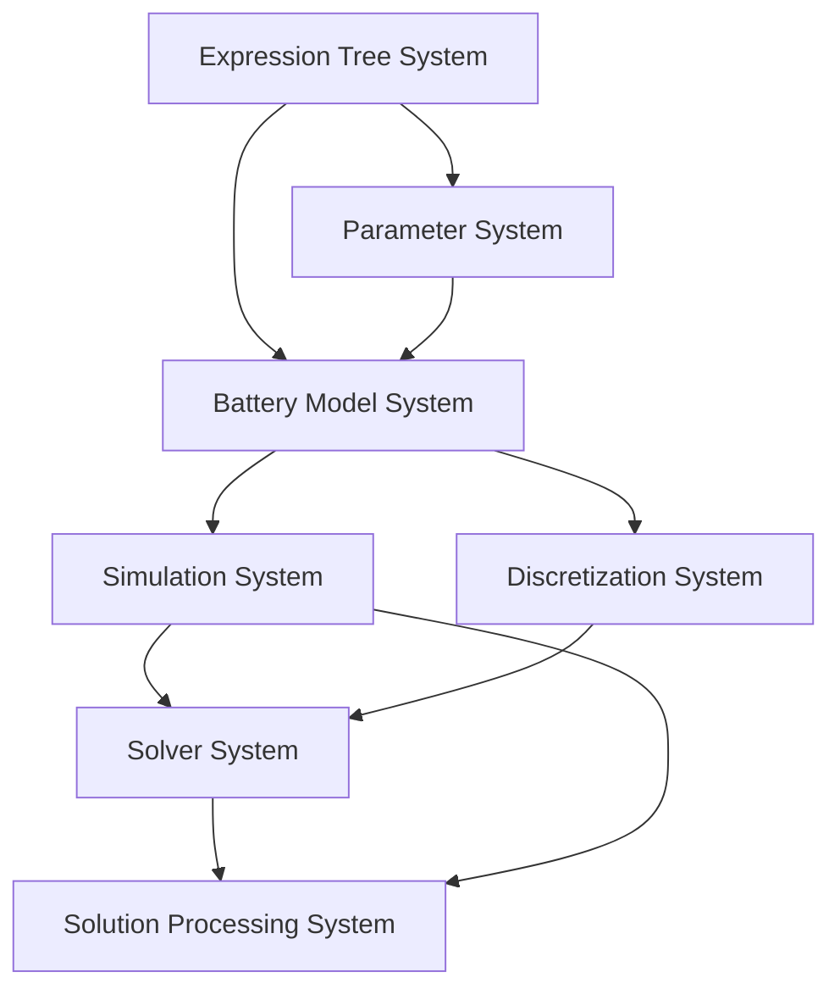

本系列文档旨在深入剖析 PyBaMM (Python Battery Mathematical Modelling) 开源项目的架构与核心功能实现。主要目标读者为希望深入理解 PyBaMM 内部机制、进行二次开发或贡献代码的科研与工程技术人员。

**请注意：** 本系列并非 PyBaMM 的入门指南。若您的目标是直接应用 PyBaMM 进行电池建模与仿真，而非修改其源代码，建议参考[官方文档](https://pybamm.org/learn/) 提供的教程和示例。

本系列文档将围绕以下几个方面展开：

1. [系统架构](#系统架构)
2. 核心模块的功能和实现
    - [表达式树 (Expression Tree)](./pybamm_expression_tree.md)
    - [模型 (Models)](./pybamm_models.md)
    - [参数 (Parameters)](./pybamm_parameters.md)
    - [几何 (Geometry)](./pybamm_geometry.md)
    - [空间方法与离散化 (Spatial Methods & Discretisations)](./pybamm_discretisation.md)
    - [求解器 (Solvers)](./pybamm_solvers.md)
    - [仿真 (Simulation)](./pybamm_simulation.md)
    - [实验 (Experiment)](./pybamm_experiment.md)
    - [绘图与后处理 (Plotting & Solution Processing)](./pybamm_plotting_and_processing.md)
3. [总结](#总结)

---

传统的电池建模和仿真方法往往面临着模型构建复杂、求解效率低、代码复用性差等挑战。PyBaMM 作为一个开源的 Python 软件包，提供了一个灵活、高效且易于扩展的平台，以解决上述问题。

## 系统架构

PyBaMM 的架构在具备可扩展性和易用性等优秀架构特性的基础上，还具有如下两个突出特征：

- **高度模块化 (Highly Modular):** 将复杂的电池物理化学过程科学地分解为一系列相互独立且可灵活组合的子模块（如电解质传质、电极反应动力学、传热机制等）。
- **原生符号化计算 (Native Symbolic Computation):** 集成符号数学计算能力（主要依托 CasADi 框架），使用户能够以贴近数学原理的直观方式定义和操作控制方程。这不仅简化了复杂模型的构建流程，还能自动完成符号微分、方程化简等数学运算，并智能生成高性能的底层数值代码。

### 核心模块

下图展示了 PyBaMM 的整体架构，各个核心模块及其相互关系：



上述核心模块在 PyBaMM 的源代码中位于 `src/pybamm` 目录下：

```
src/pybamm/
├── models/            # 定义电池模型 (DFN, SPM, etc.) 和子模型
├── expression_tree/     # 符号数学表达式的核心实现
├── parameters/          # 参数管理和加载
├── geometry/            # 定义模型几何结构
├── spatial_methods/     # 空间离散化方法 (Finite Volume, etc.)
├── discretisations/     # 将符号模型离散化为数值模型
├── solvers/             # 数值求解器接口 (CasADi, IDA, etc.)
├── simulation.py        # 仿真流程控制
├── experiment/          # 实验工况定义
├── plotting/            # 结果可视化
├── util.py              # 实用工具函数
└── ...                  # 其他辅助模块 (config, logger, etc.)
```

上述各模块的功能和实现细节将在后续文章中介绍：
- [表达式树 (Expression Tree)](./pybamm_expression_tree.md): PyBaMM 的基石，负责数学方程的符号化表示、操作和自动微分。
- [模型 (Models)](./pybamm_models.md): 如何定义和组织电池的物理化学模型及子模型。
- [参数 (Parameters)](./pybamm_parameters.md): 参数的加载、管理和在模型中的应用。
- [几何 (Geometry)](./pybamm_geometry.md): 模型几何结构的定义与管理。
- [空间方法与离散化 (Spatial Methods & Discretisations)](./pybamm_discretisation.md): 将连续的符号方程转换为离散的数值方程的过程。
- [求解器 (Solvers)](./pybamm_solvers.md): 不同数值求解器的接口与集成。
- [仿真 (Simulation)](./pybamm_simulation.md): 组织和执行整个仿真流程的控制中心。
- [实验 (Experiment)](./pybamm_experiment.md): 如何定义和模拟复杂的电池实验工况。
- [绘图与后处理 (Plotting & Solution Processing)](./pybamm_plotting_and_processing.md): 仿真结果的提取、分析与可视化。

### 仿真流程

PyBaMM 中各模块的交互遵循如下仿真流程：

1.  **模型构建与符号化 (Model Definition & Symbolic Representation - `models`, `expression_tree`):** 仿真的起点是用户选择或构建特定的电池模型（例如，`pybamm.lithium_ion.DFN()`）。这些模型由一系列描述电池内部物理化学过程的子模型构成。所有控制方程，无论是偏微分方程（PDEs）还是代数方程（AEs），均以符号形式在表达式树（Expression Tree）中表示。
2.  **参数化 (Parameterization - `parameters`):** 随后，为模型装载相应的参数集，例如通过 `pybamm.ParameterValues("Chen2020")`。这些参数值将被精确地赋给表达式树中对应的符号参数节点，从而使模型具体化。
3.  **几何构建 (Geometry Definition - `geometry`):** 基于所选模型及其参数，系统将定义计算所需的几何域（Computational Domain）。
4.  **空间离散化 (Spatial Discretization - `spatial_methods`, `discretisations`):** 用户选择合适的空间离散方法（如有限体积法, Finite Volume Method）。离散化模块负责遍历符号表达式树，将连续的微分算子（如梯度、散度）转换为离散的数值运算（通常表现为矩阵运算）。此过程将符号化的 PDEs 和 AEs 转化为适合数值求解的大规模微分代数方程组（DAEs）或常微分方程组（ODEs）。
5.  **求解器配置 (Solver Configuration - `solvers`):** 根据离散后方程组的特性，选择并配置适当的数值求解器（例如 `pybamm.CasadiSolver()`）。
6.  **仿真执行 (Simulation Execution - `simulation.py`, `experiment`):** `Simulation` 对象是整个流程的协调者，它整合了模型、参数、几何结构、离散化策略和求解器。若定义了特定的实验规程（`pybamm.Experiment`），仿真将严格遵循实验设定的步骤。求解器在每个时间步或实验阶段迭代求解方程组，最终获得电池状态变量随时间演化的数值解。
7.  **结果后处理与可视化 (Post-processing & Visualization - `plotting`, `simulation.py`):** 仿真完成后，`Solution` 对象完整地存储了所有时间步的计算结果。用户可利用 `plotting` 模块提供的工具，或直接操作 `Solution` 对象，对仿真数据进行分析和可视化。

```python
# PyBaMM 使用示例：模拟锂离子电池Doyle-Fuller-Newman (DFN) 模型的一个小时放电过程
import pybamm

# 对应流程步骤 1: 模型构建与符号化
# 用户选择或构建特定的电池模型，例如 DFN 模型。
# 模型内部的物理化学过程和控制方程以符号形式表示。
model = pybamm.lithium_ion.DFN()

# 对应流程步骤 2: 参数化
# 为模型加载参数集，将参数值赋给表达式树中的符号参数。
# 此处使用模型自带的默认参数。
parameter_values = model.default_parameter_values
# 或者: parameter_values = pybamm.ParameterValues("Marquis2019")

# 对应流程步骤 3 (几何构建), 4 (空间离散化), 5 (求解器配置)
# Simulation 对象在初始化时，会整合模型和参数，
# 内部自动完成几何定义、应用空间离散化方法（如有限体积法）、
# 并配置数值求解器（如 CasADiSolver）。
# 这些步骤将符号方程转换为大规模DAE或ODE系统。
sim = pybamm.Simulation(model, parameter_values=parameter_values)

# 对应流程步骤 6: 仿真执行
# Simulation 对象协调整个仿真流程。
# 6.a: 定义实验工况或求解时长。对于简单仿真，这通常是求解的时间区间。
t_span = [0, 3600]  # 定义求解时间从0到3600秒 (1小时)
# 6.b: 运行求解器。求解器在每个时间步迭代求解方程组。
sim.solve(t_eval=t_span)

# 对应流程步骤 7: 结果后处理与可视化
# 仿真完成后，Solution 对象存储结果。
# 用户可使用 plotting 模块或直接操作 Solution 对象进行分析和可视化。
sim.plot()
```

## 总结

本文简要介绍了 PyBaMM 开源项目的系统架构和核心工作流程，将在后续系列文章中详细介绍各模块的功能和实现细节。希望本系列文档能够为计划深入理解 PyBaMM 内部机制的开发者和研究人员提供了清晰的指引。
